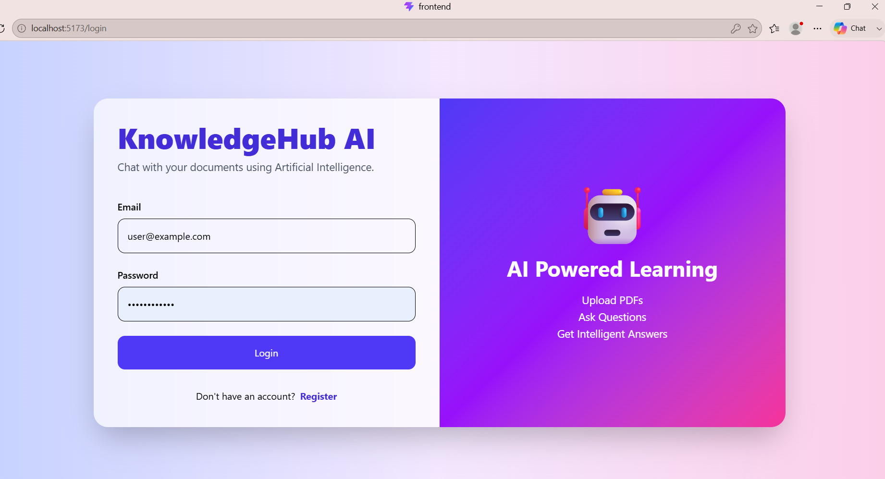
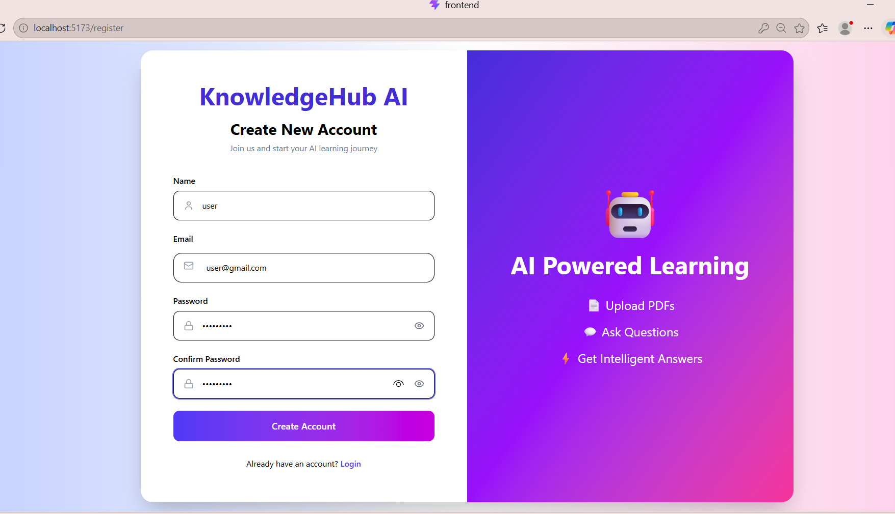
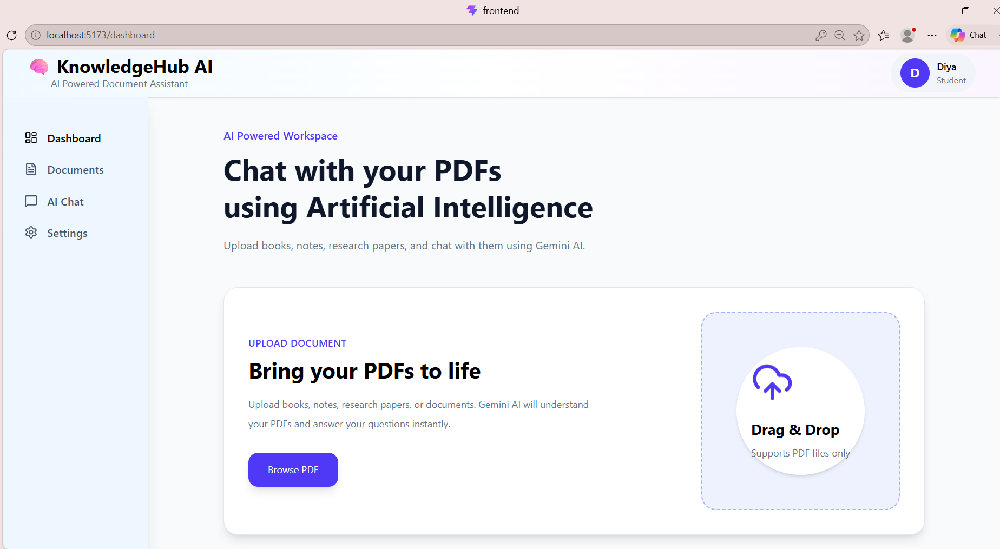
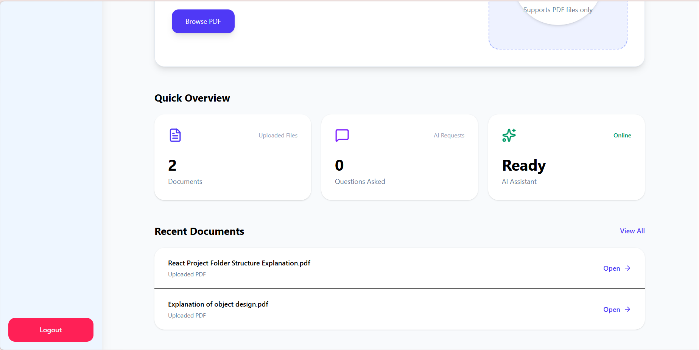
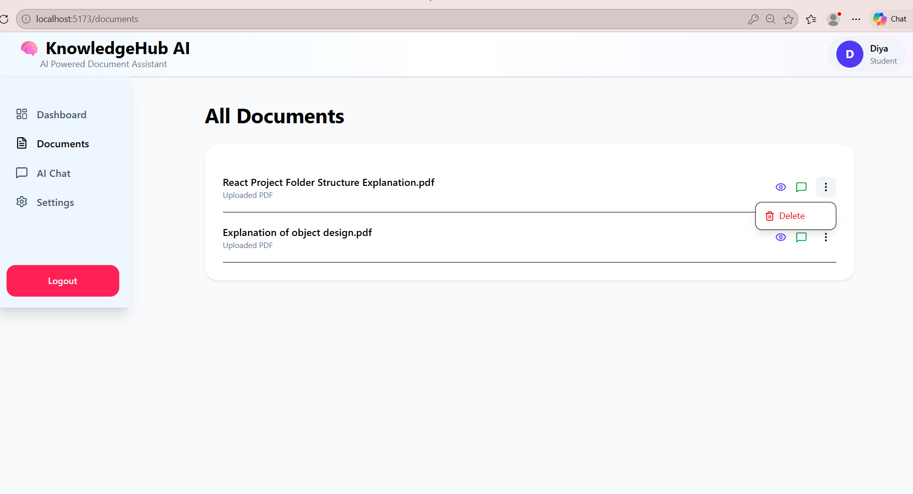
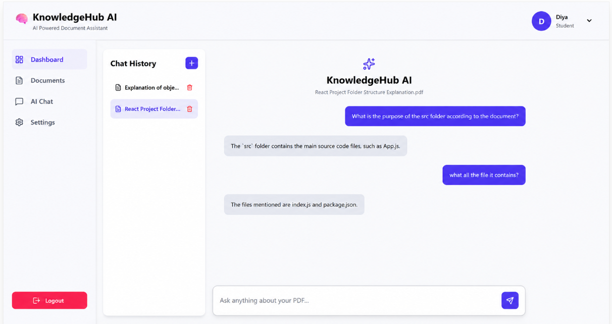
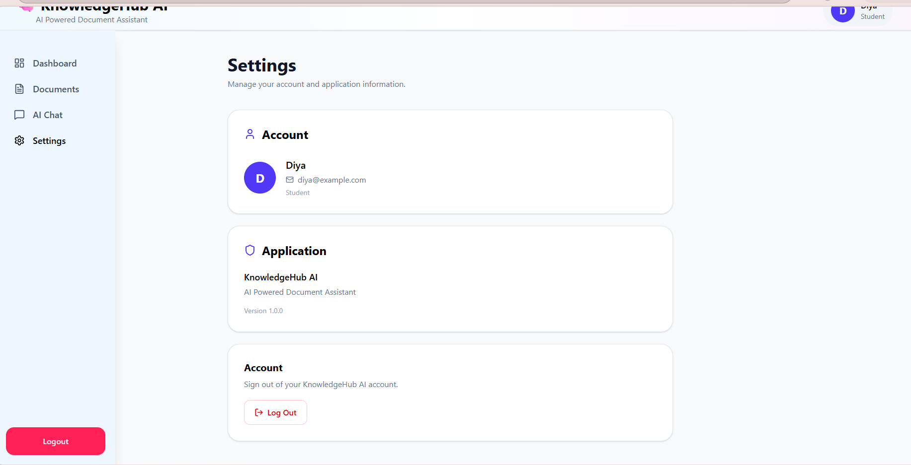

# 🧠 KnowledgeHub AI

### AI-Powered Document Assistant

KnowledgeHub AI is a full-stack AI-powered document assistant that allows users to upload PDF documents and interact with them through natural-language questions.

The application extracts content from uploaded PDFs, divides the content into meaningful text chunks, generates semantic embeddings, retrieves the most relevant information, and uses Gemini AI to generate context-aware answers.

---

## ✨ Features

- 🔐 User registration and secure login
- 👤 User profile management
- 📄 Upload and manage PDF documents
- 🔍 Semantic search across document content
- 🤖 AI-powered question answering using Gemini
- 💬 Conversational chat interface
- 🕘 Persistent chat history
- 🗑️ Delete uploaded documents
- 👁️ View uploaded PDF documents
- ⚙️ Basic settings page
- 📱 Clean and responsive user interface
- 🔒 JWT-based authentication
- 🧠 Sentence Transformer embeddings for semantic retrieval

---

## 🏗️ How It Works

The application follows a Retrieval-Augmented Generation (RAG)-style workflow:

```text
                    ┌─────────────────┐
                    │   User uploads  │
                    │      PDF        │
                    └────────┬────────┘
                             │
                             ▼
                    ┌─────────────────┐
                    │  PDF Text       │
                    │  Extraction     │
                    └────────┬────────┘
                             │
                             ▼
                    ┌─────────────────┐
                    │ Text Chunking   │
                    └────────┬────────┘
                             │
                             ▼
                    ┌─────────────────┐
                    │  Embeddings     │
                    │ MiniLM Model    │
                    └────────┬────────┘
                             │
                             ▼
User Question ──────► Semantic Search
                             │
                             ▼
                    ┌─────────────────┐
                    │ Relevant        │
                    │ Context         │
                    └────────┬────────┘
                             │
                             ▼
                    ┌─────────────────┐
                    │   Gemini AI     │
                    │     Answer      │
                    └────────┬────────┘
                             │
                             ▼
                    ┌─────────────────┐
                    │ Chat Interface  │
                    └─────────────────┘
```

---

## 🛠️ Tech Stack

### Frontend

- React
- Vite
- Tailwind CSS
- JavaScript
- Axios
- Lucide React

### Backend

- Python
- FastAPI
- PostgreSQL
- Pydantic
- JWT Authentication

### AI & NLP

- Google Gemini AI
- Sentence Transformers
- `all-MiniLM-L6-v2`
- Semantic similarity search

### Database & Storage

- SQLAlchemy
- Relational database
- Local PDF storage

---

## 📂 Project Structure

```text
KnowledgeHubAI/
│
├── backend/
│   ├── app/
│   │   ├── core/
│   │   ├── database/
│   │   ├── models/
│   │   ├── routers/
│   │   ├── schemas/
│   │   └── services/
│   │
│   ├── main.py
│   └── .env.example
│
├── frontend/
│   ├── src/
│   │   ├── api/
│   │   ├── components/
│   │   ├── context/
│   │   ├── layout/
│   │   ├── pages/
│   │   └── services/
│   │
│   ├── package.json
│   └── vite.config.js
│
├── requirements.txt
├── .gitignore
└── README.md
```

---

## 🔄 AI Processing Pipeline

When a user asks a question about an uploaded PDF:

1. The PDF text is extracted.
2. The extracted text is divided into smaller chunks.
3. Each chunk is converted into an embedding using the Sentence Transformer model.
4. The user's question is compared with the document embeddings.
5. The most relevant content is retrieved using semantic search.
6. The retrieved context is provided to Gemini AI.
7. Gemini generates an answer based on the retrieved document content.
8. The question and answer are displayed in the conversational interface and stored in chat history.

---

## 🔐 Authentication

KnowledgeHub AI uses JWT-based authentication to protect user-specific functionality.

The application includes:

- User registration
- Secure password hashing
- User login
- JWT access tokens
- Protected API endpoints
- User-specific document access

Sensitive credentials are stored using environment variables and are excluded from version control.

---

## ⚙️ Installation & Setup

### 1. Clone the Repository

```bash
git clone https://github.com/DiyaJannu/KnowledgeHubAI.git
cd KnowledgeHubAI
```

### 2. Backend Setup

Navigate to the backend:

```bash
cd backend
```

Create a virtual environment:

```bash
python -m venv venv
```

Activate the virtual environment on Windows:

```bash
venv\Scripts\activate
```

Install the required dependencies:

```bash
pip install -r ../requirements.txt
```

### 3. Configure Environment Variables

Create a `.env` file inside the `backend` folder.

Use `.env.example` as a reference:

```env
DATABASE_URL=your_database_url_here
GEMINI_API_KEY=your_gemini_api_key_here
```

**Never commit your actual `.env` file or API keys to GitHub.**

### 4. Start the Backend

From the `backend` directory:

```bash
uvicorn main:app --reload
```

The FastAPI backend will run locally at:

```text
http://127.0.0.1:8000
```

Interactive API documentation is available at:

```text
http://127.0.0.1:8000/docs
```

---

## 💻 Frontend Setup

Open a new terminal and navigate to the frontend:

```bash
cd frontend
```

Install the frontend dependencies:

```bash
npm install
```

Start the development server:

```bash
npm run dev
```

The frontend will run at the local URL provided by Vite, typically:

```text
http://localhost:5173
```

---

## 🔑 Environment Variables

| Variable | Description |
|----------|-------------|
| `DATABASE_URL` | Database connection configuration |
| `GEMINI_API_KEY` | API key used for Gemini AI |

For security, actual credentials should never be committed to the repository.

---

## 📸 Screenshots

### 🔐 Authentication

<p align="center">
  
  
</p>

### 🏠 Dashboard

<p align="center">
  
</p>

<p align="center">
  
</p>

### 📄 Document Management

<p align="center">
  
</p>

### 🤖 AI Chat

<p align="center">
  
</p>

### ⚙️ Settings

<p align="center">
  
</p>
## 🚀 Future Improvements

- ⚡ Improve AI response time
- 📚 Support multiple documents in a single conversation
- 🔎 Improve document retrieval and ranking
- 🌐 Deploy the application to a cloud platform
- 📱 Further improve mobile responsiveness
- 🎨 Additional UI themes
- 🧠 Enhance document understanding and retrieval

---

## 🎯 Project Objective

KnowledgeHub AI aims to provide a simple and intuitive way for users to interact with their documents using natural language.

Instead of manually searching through lengthy PDF documents, users can ask questions and receive relevant answers based on the uploaded document content.

---

## 👩‍💻 Author

**Diya Jannu**

GitHub: [DiyaJannu](https://github.com/DiyaJannu)

---

## 📄 License

This project is currently intended for educational, portfolio, and demonstration purposes.
